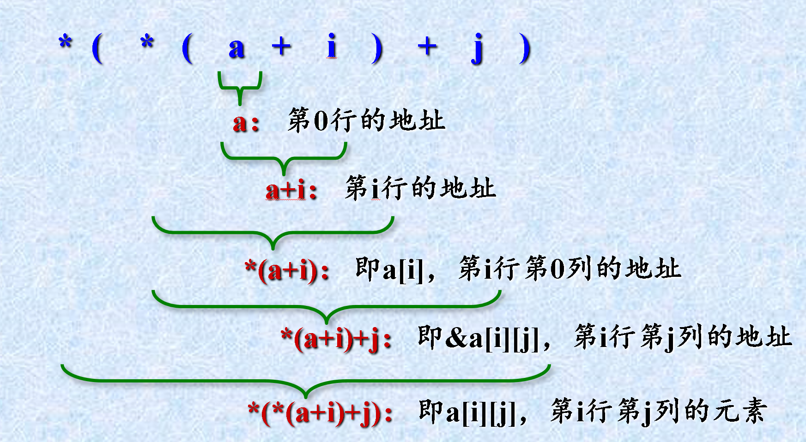
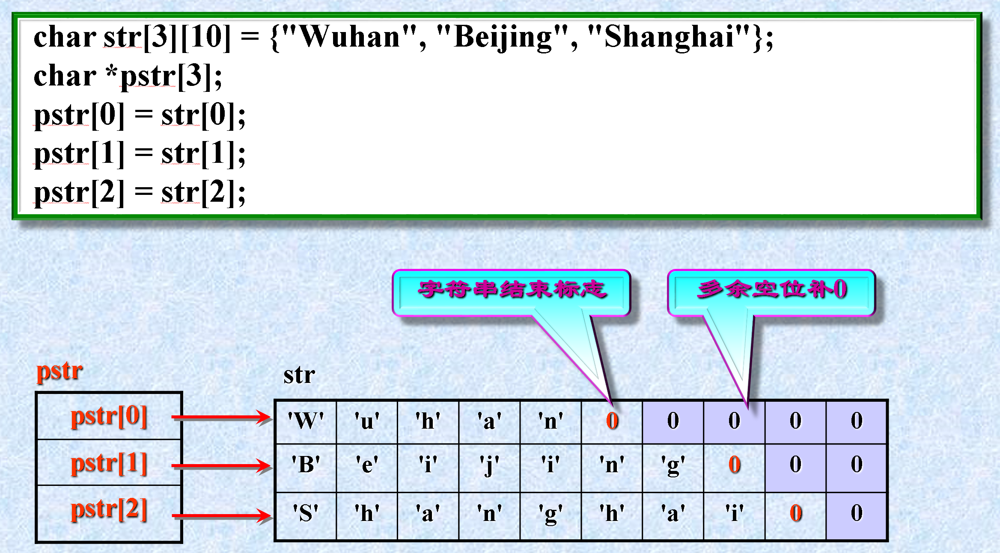
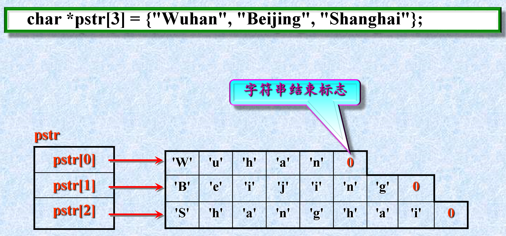

3、指针与指针变量
指针：一个变量的地址
指针变量：专门存放变量地址的变量

注意：
 int   *p1, *p2;   与   int   *p1, p2;
 指针变量名是p1，p2 ，不是*p1，*p2
 指针变量只能指向定义时所规定类型的变量
 指针变量定义后，变量值不确定，应用前必须先赋值

4、&与*运算符
两者关系：互为逆运算

 注意：一个指针变量只能指向同类型的变量。如果给指针赋值时，=号右边的指针类型与左边的指针类型不同，则需要进行类型强制转换。  
int  a;
int  *pi;
char *pc;
pi = &a;                //pi指向a
pc = (char *)pi;    //pc也指向了a，即pi和pc的值都是a的地址

```c
#include <stdio.h>
int main ( )
{
   unsigned short a;
   unsigned short *pi = &a; 
   char *pc = (char *)&a; 
   *pi = 0XF0F0;
   *pc = 0;
   printf ("a = %X", a);
   return 0;
}
```
输出结果为：a = F000

p ± n 的值   =  ADDR ± n * sizeof（ptype）

若p1和p2指向同一数组，则
 p1<p2    表示p1指的元素在前
 p1>p2    表示p1指的元素在后
 p1==p2   表示p1与p2指向同一元素
若p1与p2不指向同一数组，比较无意义

```c
int a[10];
int k;
for (k = 0; k < 10; k++)
   a[k] = k;     //利用数组下标
```
等价于
```c
int a[10];
int k;
for (k = 0; k < 10; k++)
   *(a+k) = k;  //利用数组的指针
```

```c
int main( )
{    
   int a[5], *pa, i;
   for (i = 0; i < 5; i++)
       a[i]=i+1;
    pa = a;
    for (i = 0; i < 5; i++)
        printf ("*(pa+%d):%d\n", i, *(pa+i));
    for (i = 0; i < 5; i++)
        printf ("*(a+%d):%d\n", i, *(a+i));
    for (i = 0; i < 5; i++)
        printf ("pa[%d]:%d\n", i, pa[i]);
    for (i = 0; i < 5; i++)
        printf("a[%d]:%d\n", i, a[i]);
    return 0;
}
```

3、指向多维数组的指针____数组指针

```c
#include <stdio.h>
int main ( )
{
  short int a[2][3] = {{1, 2, 3}, {4, 5, 6}};
  short int i, j, *p;

  p = &a[0][0];  
  for (i = 0; i < 2; i++)
  {
    for (j = 0; j < 3; j++)
      printf ("a[%d][%d] = %d ",
                                 i, j, *(p + i*3 + j));  
    printf ("\n");   
  }  
  return 0; 
}
```
注意：假设有一个m行n列的二维数组a：
 a[i]（i在0到m-1之间）为第i+1行的首地址，是一个地址常量。如上例中的a[0]表示第一行的首地址，当然也是整个二维数组元素所占内存单元的首地址，a[1]表示第二行的首地址。
 当二维数组的首地址赋给指针变量p以后，则访问某个元素a[i][j]可用以下几种方式来代替：*(p+i*n+j)、p[i*n+j]、*(a[0]+i*n+j)。
 二维数组名a不可赋值给一般指针变量p，只能赋值给指向二维数组的指针变量。p = a；是非法的。

 当指针p指向这个二维数组时，其实p就相当于一个一维数组，因此访问二维数组中的元素可分别用p[0]…p[5]或*(p+0)…*(p+5)来表示 

 如果将二维数组名a看成一个行地址（第0行的地址），则a+i代表二维数组a的第i行的地址，a[i]可看成一个列地址，即第i行第0列的地址。行地址a每次加1，表示指向下一行，而列地址a[i]每次加1，表示指向下一列。

 


元素为指针的数组____指针数组

数据类型符   *变量名[常量表达式];

利用指针数组对键盘输入的5个整数进行从小到大排序。

```c

#include <stdio.h>

int main( )
{
    int a[5], i, j, t, *p[5];
    for (i = 0; i < 5; i++)
    {
        printf ("Input a[%d]:", i);
        scanf ("%d", &a[i]);
        p[i] = &a[i];
    }
    for (i = 0; i < 4; i++)
        for (j = i + 1; j < 5; j++)
            if (*p[i] > *p[j])
            {
                t = *p[i];
                *p[i] = *p[j];
                *p[j] = t;
            }
    for (i = 0; i < 5; i++)
        printf ("%d ", *p[i]);
    return 0;
}
```
指针与字符串
2、字符指针变量与字符数组
char  *cp;    与    char str[20];
str由若干元素组成，每个元素放一个字符；而cp中存放字符串首地址
char  str[20];     str="I love China!";    (x)
char   *cp;         cp="I love China!";    (√)
str是地址常量；cp是地址变量
cp接受键入字符串时,必须先开辟存储空间

例   char  str[10];
       scanf("%s",str);    (x)

而   char  *cp;
       scanf("%s",  cp);    (√)

改为:  char   *cp, str[10];
           cp = str;
           scanf ("%s",cp);      ()


【例】 利用字符指针实现字符串的倒序排列 

```c
#include <stdio.h>
#include <string.h>
int main ( )
{
  char str[200], ch;
  char *p, *q;
  gets (str);                      //读取一个字符串
  p = str;                         //p指向字符串的首地址
  q = p + strlen(p) - 1;   //q指向字符串的末地址
  while (p < q)
  {                        //交换p和q各自指向的字符
    ch = *p;         //将p所指向的字符保存在ch中
    *p++ = *q;    //先将q指向的字符赋给p指向的字符单元，p再增1
    *q-- = ch;      //先将ch的值赋给q指向的字符单元，q再减1
  }
  printf ("%s\n", str);  
  return 0;
}
```

 字符串指针数组与字符串二维数组之间的区别 




【例】利用字符指针数组对一组城市名进行升序排列。 

```c
#include <stdio.h>
#include <string.h>
int main ( )
{   
  int i, j, k;
  char *pcity[ ] = {"Wuhan", "Beijing","Shanghai",
                              "Tianjin", "Guangzhou",""};
  char *ptemp;
  for (i = 0; strcmp(pcity[i],"") != 0; i++)
  {
    k = i; 
    for (j = i+1; strcmp(pcity[j],"") != 0; j++)
         if (strcmp(pcity[k], pcity[j]) > 0)    k = j;
    if (k != i)
    {
ptemp = pcity[i];
pcity[i] = pcity[k];
pcity[k] = ptemp;
    }
  }  
  for (i = 0; strcmp(pcity[i],"") != 0; i++)    printf ("%s  ", pcity[i]);
    printf ("\n");
    return 0;
  }
  
```

指针作为函数的参数 

参数传递方式
传值调用：将参数值传递给形参。实参和形参占用各自的内存单元，互不干扰，函数中对形参值得改变不会改变实参的值，属于单向数据传递方式。
传址调用：将实参的地址传递给形参。形参和实参占用同样的内存单元，对形参值得改变也会改变实参的值，属于双向数据传递方式。

【例】将数从大到小输出

```c
void swap(int  *p1, int  *p2)
{   
   int p;
   p = *p1;
   *p1 = *p2;
   *p2 = p;
}
int main (  )
{   
    int a, b, *p_1, *p_2;
    scanf ("%d,%d", &a, &b);
    p_1 = &a;  p_2 = &b;
    if (a < b)  swap (p_1, p_2);
    printf ("\n%d,%d\n", a, b);
    return 0;
}
```
【例】编写一函数alltrim用于去掉字符串的前导空格和后续空格。 


9.9  指针作为函数的返回值____指针函数
 一个函数可以返回一个int型、float型、char型的数据，也可以返回一个指针类型的数据。 返回指针值的函数（简称指针函数）的定义格式如下：

 函数类型   *函数名( [形参1, 形参2,…, 形参n] )
 
这句话是用C语言中的动态内存分配函数`malloc`来为一个字符数组分配内存空间。我们可以逐步分析这句话的含义：

1. **`char *`**:
   - 这是一个字符指针，表示将要存储字符的地址。

2. **`malloc`**:
   - `malloc`是标准库函数，用于在堆区动态分配指定大小的内存，并返回指向这段内存的指针。函数原型在`stdlib.h`头文件中定义。

3. **`size * sizeof(char)`**:
   - 这是传递给`malloc`的参数，表示要分配的内存大小。`size`是一个变量，表示你想要的字符数量。
   - `sizeof(char)`返回一个`char`类型的大小，通常是1字节（即8位）。所以，这里的`size * sizeof(char)`实际上是`size`个字节的内存空间。

4. **`(char *)`**:
   - 这是类型转换（type cast），将`malloc`返回的`void *`类型的指针转换为`char *`类型。这是必要的，因为`malloc`返回的是一个通用的`void *`指针，但我们希望将其用作`char`类型指针。

5. **`p = (char *)malloc(size * sizeof(char));`**:
   - 这一整句表示：为`size`个`char`类型变量分配足够的内存，并将返回的指针赋值给`p`，这个指针类型是`char *`。

完整解释：
```c
char *p; // 声明一个字符指针 p
p = (char *)malloc(size * sizeof(char)); // 为 size 个 char 分配内存，并将返回的指针赋值给 p
```

注意事项：
- `malloc`函数返回的指针应在使用完毕后通过`free`函数来释放，以避免内存泄漏。
- `malloc`分配的内存未初始化，因此内容是未定义的，如果需要可以使用`memset`或`calloc`来初始化。

示例代码：
```c
#include <stdio.h>
#include <stdlib.h>

int main() {
    int size = 10;
    char *p = (char *)malloc(size * sizeof(char)); // 分配内存

    if (p == NULL) { // 检查是否分配成功
        printf("Memory allocation failed!\n");
        return 1;
    }

    // 使用分配的内存
    for (int i = 0; i < size; i++) {
        p[i] = 'a' + i; // 填充字符数据
    }

    for (int i = 0; i < size; i++) {
        printf("%c ", p[i]); // 打印字符数据
    }
    printf("\n");

    free(p); // 释放内存
    return 0;
}
```
这段代码演示了如何分配、使用和释放动态内存。


注意：如果一个函数返回一个指针，不能返回auto型局部变量的地址，但可以返回static型变量的地址。 

编写指针函数返回的指针通常有以下几种：
函数中动态分配的内存（通过malloc等实现）的首地址；
函数中的静态（static）变量或全局变量所对应的内存单元的首地址；
通过指针形参所获得的实参的有效地址。 


